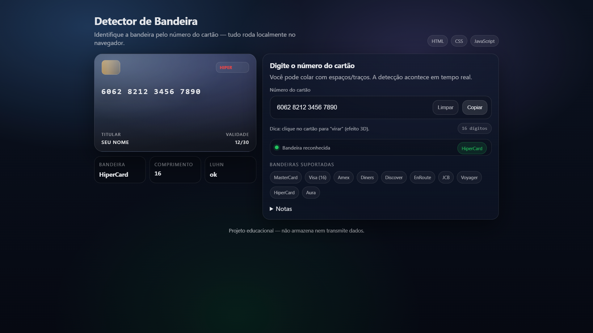

# Credit Card Flag Detector

Aplicação web **educacional** para **detectar a bandeira de um cartão** a partir do número informado (BIN/prefixos + regras de comprimento) e exibir feedback de **validação Luhn** em tempo real. Tudo roda **localmente no navegador** (sem dependências e sem backend).

## Screenshot



## Destaques

- **Detecção em tempo real** da bandeira com base em prefixos e tamanho do número
- **Validação Luhn** (com status visual: ok / falhou / curto)
- Interface moderna com **preview do cartão (efeito 3D + flip)** ao clicar
- **Logos em SVG inline** (sem requisições externas)
- Botões utilitários: **limpar** e **copiar apenas dígitos**
- Projeto **100% front-end**: HTML + CSS + JavaScript

## Bandeiras suportadas

O detector implementa regras práticas (para fins de estudo) para identificar:

- MasterCard
- Visa (16)
- American Express
- Diners Club
- Discover
- EnRoute
- JCB
- Voyager
- HiperCard
- Aura

> Observação: alguns intervalos/prefixos podem variar conforme a fonte (especialmente bandeiras antigas/regionais). Este projeto prioriza uma implementação objetiva para aprendizado.

## Demo / Como usar

### Rodando localmente (sem instalar nada)

1. Clone o repositório:
   ```bash
   git clone https://github.com/diegobrnrd/credit-card-flag-detector.git
   ```
2. Acesse a pasta:
   ```bash
   cd credit-card-flag-detector
   ```
3. Abra o arquivo `index.html` no navegador.

Dica: se você utiliza VS Code, pode usar a extensão **Live Server** para recarregar automaticamente.

## Como funciona

A lógica está concentrada em `script.js` e segue três etapas principais:

1. **Sanitização do input**  
   Remove qualquer caractere não numérico (permite colar com espaços/traços).

2. **Detecção de bandeira (regras/BIN)**  
   A função `detectBrand(digits)` aplica regex e checagens por faixa:
   - Visa: `^4` com **16 dígitos**
   - MasterCard: `51–55` ou `2221–2720` com **16 dígitos**
   - Amex: `34` ou `37` com **15 dígitos**
   - Discover: `6011`, `65`, `644-649`, `622126-622925` etc.
   - Demais bandeiras: prefixos/intervalos específicos

3. **Validação Luhn**  
   A função `luhnCheck(digits)` verifica se o número passa no algoritmo de Luhn e atualiza os estados visuais (status, badge e indicador).

## Estrutura do projeto

- `index.html` — layout e marcação da interface
- `styles.css` — estilos (visual “glass”, cartão 3D, responsividade)
- `script.js` — regras de detecção, Luhn e interações da UI

## Privacidade e segurança

Este é um projeto **educacional**. A aplicação:

- **não armazena** números de cartão
- **não envia** dados para servidor
- executa toda a detecção **localmente** no navegador

Ainda assim, evite inserir dados reais em demonstrações públicas.

## Roadmap (ideias)

- [ ] Adicionar suporte a **Visa 13/19** (opcional) e outras variações
- [ ] Separar “core” de detecção em módulo reutilizável (`detector.js`)
- [ ] Testes unitários para regras e Luhn
- [ ] Publicar demo via GitHub Pages

## Contribuindo

Contribuições são bem-vindas!

1. Faça um fork do projeto
2. Crie uma branch: `git checkout -b feature/minha-feature`
3. Commit: `git commit -m "feat: minha feature"`
4. Push: `git push origin feature/minha-feature`
5. Abra um Pull Request

## Licença

Distribuído sob a licença MIT. Veja `LICENSE` para mais informações.
