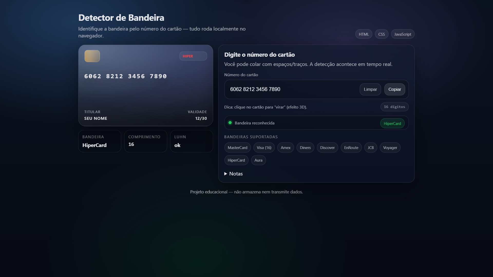

# Credit Card Flag Detector

[](https://developer.mozilla.org/en-US/docs/Web/HTML)
[](https://developer.mozilla.org/en-US/docs/Web/CSS)
[](https://developer.mozilla.org/en-US/docs/Web/JavaScript)

**Educational** web application to **detect a card's brand** from the entered number (BIN/prefixes + length rules) and display real-time **Luhn validation** feedback. Everything runs **locally in the browser** (no dependencies and no backend).

## Screenshot



## Highlights

- **Real-time detection** of the brand based on prefixes and number length
- **Luhn validation** (with visual status: ok / failed / short)
- Modern interface with **card preview (3D effect + flip)** on click
- **Inline SVG logos** (no external requests)
- Utility buttons: **clear** and **copy digits only**
- **100% front-end** project: HTML + CSS + JavaScript

## Supported Brands

The detector implements practical rules (for study purposes) to identify:

- MasterCard
- Visa (16)
- American Express
- Diners Club
- Discover
- EnRoute
- JCB
- Voyager
- HiperCard
- Aura

> Note: some ranges/prefixes may vary depending on the source (especially older/regional brands). This project prioritizes a straightforward implementation for learning purposes.

## Demo / How to Use

### Running locally (without installing anything)

1. Clone the repository:
   ```bash
   git clone https://github.com/diegobrnrd/credit-card-flag-detector.git
   ```
2. Go to the folder:
   ```bash
   cd credit-card-flag-detector
   ```
3. Open the `index.html` file in your browser.

Tip: if you use VS Code, you can use the **Live Server** extension to auto-reload.

## How It Works

The logic is concentrated in `script.js` and follows three main steps:

1. **Input sanitization**
   Removes any non-numeric character (allows pasting with spaces/dashes).

2. **Brand detection (rules/BIN)**
   The `detectBrand(digits)` function applies regex and range checks:
   - Visa: `^4` with **16 digits**
   - MasterCard: `51–55` or `2221–2720` with **16 digits**
   - Amex: `34` or `37` with **15 digits**
   - Discover: `6011`, `65`, `644-649`, `622126-622925`, etc.
   - Other brands: specific prefixes/ranges

3. **Luhn validation**
   The `luhnCheck(digits)` function checks whether the number passes the Luhn algorithm and updates the visual states (status, badge, and indicator).

## Project Structure

- `index.html` — interface layout and markup
- `styles.css` — styling ("glass" look, 3D card, responsiveness)
- `script.js` — detection rules, Luhn, and UI interactions

## Privacy and Security

This is an **educational** project. The application:

- **does not store** card numbers
- **does not send** data to a server
- performs all detection **locally** in the browser

Even so, avoid entering real data in public demos.

## Roadmap (ideas)

- [ ] Add support for **Visa 13/19** (optional) and other variations
- [ ] Separate the detection "core" into a reusable module (`detector.js`)
- [ ] Unit tests for rules and Luhn
- [ ] Publish demo via GitHub Pages

## Contributing

Contributions are welcome!

1. Fork the project
2. Create a branch: `git checkout -b feature/my-feature`
3. Commit: `git commit -m "feat: my feature"`
4. Push: `git push origin feature/my-feature`
5. Open a Pull Request

## Author

[**Diego Bernardo**](https://github.com/diegobrnrd)

## License

This project is licensed under the **MIT License**.
See the [LICENSE](LICENSE) file.
